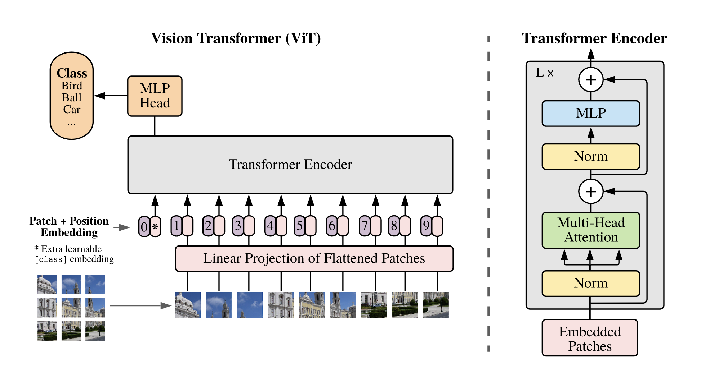

# My ViT
Creating my own ViT from: [Coding a Vision Transformer from scratch using PyTorch](https://www.youtube.com/watch?v=DdsVwTodycw)

**Goal**: Object classification using transformers

## Paper
[An Image is Worth 16x16 Words: Transformers for Image Recognition at Scale](https://arxiv.org/abs/2010.11929)

## Architecture

The main components of a ViT are:

1. Embedding Part
    1. Patches
    1. Class token
    1. Positional Embedding (learnable)
1. Transformers Part
    1. Layer Norm
    1. Transformer Block - Multihead attention
    1. Layer Norm
    1. MLP
1. MLP Head Part
    1. Classification output
